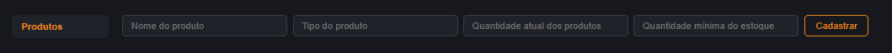
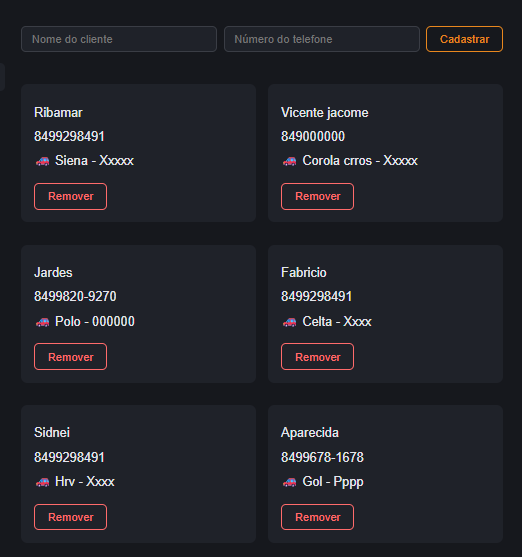
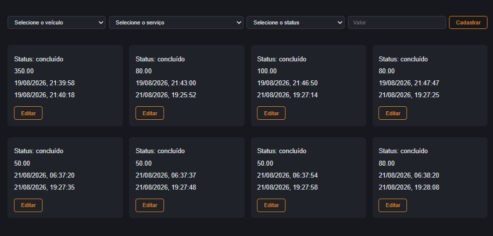
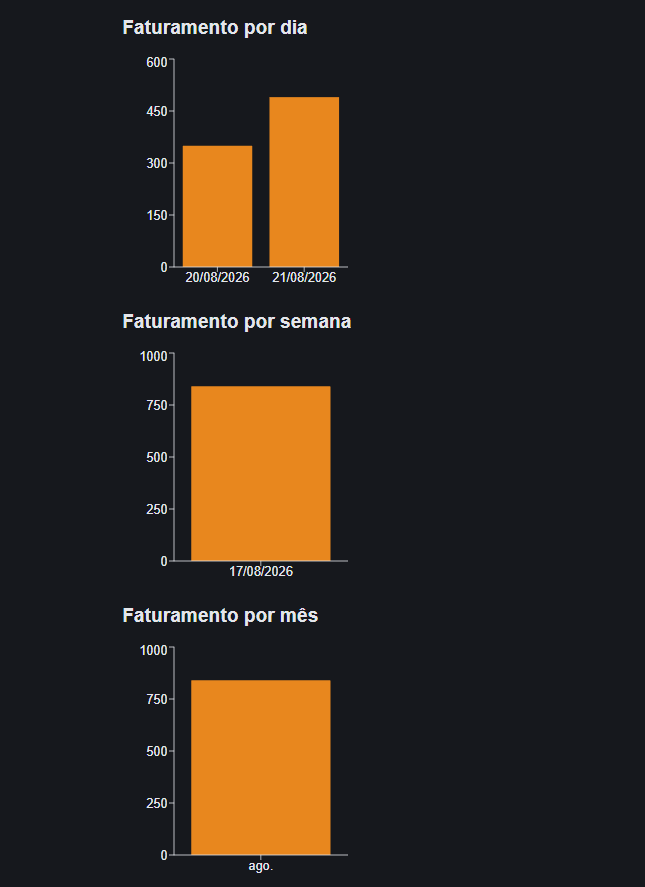

# Sistema de Gestão — Estética Automotiva

Sistema completo de gestão para estéticas automotivas: controle de estoque, clientes, veículos, serviços, ordens de serviço, movimentações de produtos, despesas e faturamento com gráficos.

🔗 **Demo ao vivo:** [estetica-automotiva-orpin.vercel.app](https://estetica-automotiva-orpin.vercel.app)

---

## Sobre o projeto

Este sistema foi desenvolvido para digitalizar a rotina de uma estética automotiva, substituindo controles manuais (planilhas e cadernos) por uma solução única, acessível de qualquer dispositivo com internet.

### Funcionalidades

- **Produtos** — cadastro de itens de estoque, com alerta automático de estoque baixo
- **Movimentações de estoque** — registro de entrada e saída de produtos, com atualização automática da quantidade
- **Clientes** — cadastro com visualização dos veículos vinculados
- **Veículos** — cadastro vinculado a um cliente (tipo, placa, modelo, cor)
- **Serviços** — catálogo de serviços oferecidos, com preço
- **Ordens de Serviço** — abertura e fechamento de atendimentos, ligando veículo, serviço e valor
- **Despesas** — registro de gastos por categoria (produtos, funcionários, outros)
- **Faturamento** — faturamento bruto, despesas, faturamento líquido, e gráficos por mês, semana e dia
- **Uso de Serviços** — quantidade de serviços concluídos por veículo

### Layout responsivo

O sistema se adapta a diferentes tamanhos de tela, incluindo dispositivos móveis.

---

## Capturas de tela

### Produtos e controle de estoque


### Clientes e veículos


### Ordem de Serviço


### Faturamento com gráficos


---

## Tecnologias utilizadas

**Frontend**
- React (Vite)
- Recharts (gráficos)
- CSS puro (variáveis CSS, media queries)

**Backend**
- Node.js
- Express
- PostgreSQL ([Neon](https://neon.tech))

**Deploy**
- Backend: [Render](https://render.com)
- Frontend: [Vercel](https://vercel.com)
- Monitoramento de uptime: [UptimeRobot](https://uptimerobot.com)

---

## Estrutura do projeto

```
estetica-automotiva-jn/
├── backend/
│   ├── src/
│   │   ├── server.js          # Servidor Express e rotas da API
│   │   └── criarTabelas.js    # Script de criação das tabelas
│   └── package.json
└── frontend/
    ├── src/
    │   ├── Produtos.jsx
    │   ├── Clientes.jsx
    │   ├── Veiculos.jsx
    │   ├── Servicos.jsx
    │   ├── OrdemServico.jsx
    │   ├── Despesas.jsx
    │   ├── Faturamento.jsx
    │   ├── UsoServicos.jsx
    │   └── App.jsx
    └── package.json
```

---

## Rodando localmente

### Pré-requisitos
- Node.js (v18+)
- Uma instância PostgreSQL (local ou serviço na nuvem como o Neon)

### Backend

```bash
cd backend
npm install
```

Crie um arquivo `.env` na pasta `backend` com:
```
DATABASE_URL=sua_connection_string_do_postgresql
```

```bash
node src/server.js
```

O servidor sobe em `http://localhost:3000`.

### Frontend

```bash
cd frontend
npm install
```

Crie um arquivo `.env` na pasta `frontend` com:
```
VITE_API_URL=http://localhost:3000
```

```bash
npm run dev
```

O frontend sobe em `http://localhost:5173`.